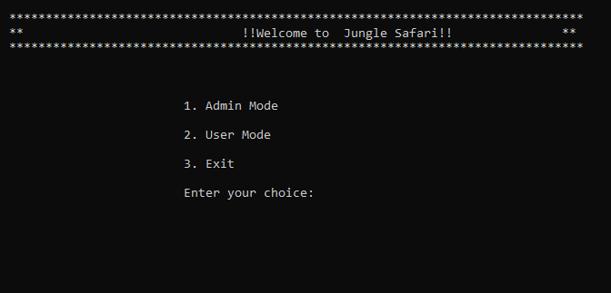
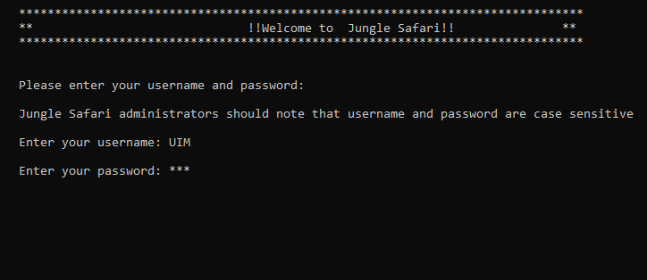
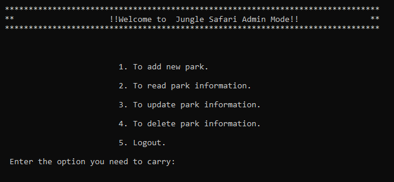
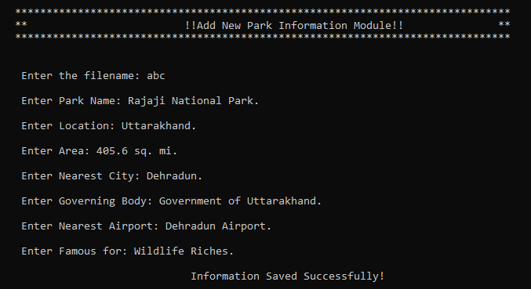
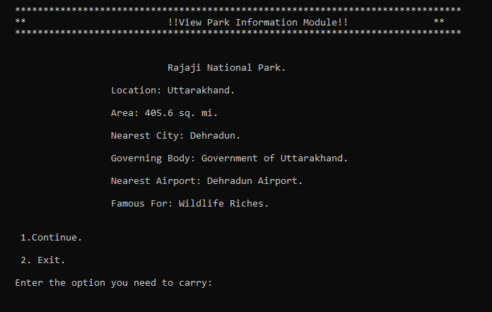
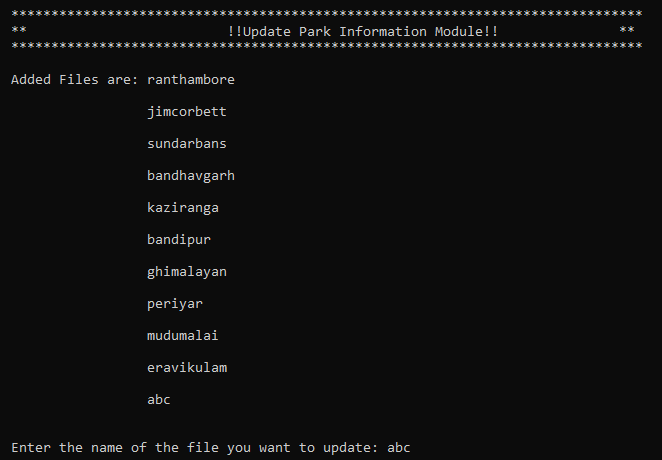
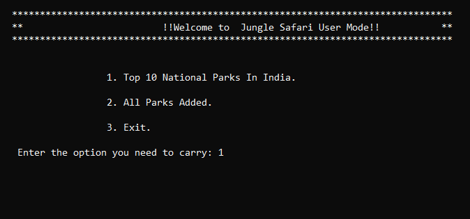

# Jungle Safari in C
## Introduction
The project “Jungle Safari” manages the information of the top 10 national parks in India.

It can save the details of a national parks like:-
1.   Location.
2.    Nearest City.
3.    Area.
4.    Established Year.
5.    Governing Body.
6.    Nearest Airport.
7.    Famous For.

 It lets you view the information of a park, add information of a new park, update information of a park and delete information of a park.
 
 ## Objectives
 
 * It  provides  security  from  unauthorized  access,  only  admin  or  authorized  users  are  granted access to the  system.
 
 * Single window solution of major national parks in India.
 
 * Easy access of saved data inside the system which saves the time.
 
 ## Proposed System
 
 As there is no existing system present at this time so the proposed system has the following characterstics:-
 
 * Contains information of the major national parks in India at a single platform.
 
 * Easily generate reports which saves users time.
 
 ## Programming Languages and Concepts Used
 
 * C
 * File Handling is used to save the park's information.
 
 ## List of Reports
 
 ### Login Module
 

 ### Admin Mode Module
 

 ### Add Park Information Module
 

 ### Read Park Information Module
 
 
 
 ### Update Park Information Module
 
 
 
 ### Delete Park Information Module
 
 
 
 ### User Mode
 
 
 
 ## Future Scope and Further Enhancement
 
 * In future we can develop a website of this project containing vast information of the national parks and covering all the major national parks in India.
 
 * The application can be coded in different programming languages so as to run it in different platforms like Symbian, java based phones, Android, Windows Phone, Blackberry, IOS etc.
 

 
 

 
 
 
 
 

